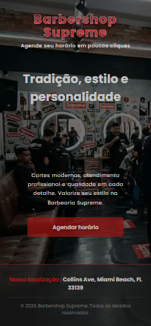

# 💈 Barbershop Supreme — Agendamento Web Online

O **Barbershop Supreme** é um sistema web de agendamento online desenvolvido para facilitar o processo de marcação de horários em uma barbearia.

A ideia do projeto é permitir que o cliente escolha o **serviço, barbeiro, data e horário** de forma simples, sem precisar entrar em contato diretamente para consultar a disponibilidade.

O projeto também possui um **painel administrativo**, onde os agendamentos realizados podem ser visualizados e acompanhados.

🔗 **Demo ao vivo:** [Acesse o Barbershop Supreme](https://josetovar93.github.io/Barbershop-Supreme/)

---

## 📸 Preview



---

## 🚀 Funcionalidades

### 📱 Para o cliente

* Escolha do serviço.
* Escolha do barbeiro.
* Visualização dos profissionais.
* Seleção de data e horário.
* Verificação dos horários disponíveis.
* Cadastro com nome e telefone.
* Realização do agendamento.

### 💼 Painel administrativo

* Login para acesso ao painel.
* Visualização dos agendamentos.
* Visualização do nome e telefone do cliente.
* Visualização do serviço escolhido.
* Visualização do barbeiro.
* Visualização da data e horário do agendamento.

---

## 🛠️ Tecnologias utilizadas

* **HTML5**
* **CSS3**
* **JavaScript**
* **Firebase Authentication**
* **Firebase Firestore**
* **WhatsApp**
* **Git e GitHub**

---

## 🔥 Firebase

O projeto utiliza o **Firebase** para armazenar e gerenciar os agendamentos realizados pelos clientes.

Também foi utilizado o **Firebase Authentication** para controlar o acesso ao painel administrativo.

---

## 💻 Como executar

Clone o projeto:

```bash
git clone https://github.com/josetovar93/Barbershop-Supreme.git
```

Entre na pasta:

```bash
cd Barbershop-Supreme
```

Depois, abra o projeto no **VS Code** e execute utilizando o **Live Server**.

---

## 🔄 Próximas melhorias

Este projeto continua em desenvolvimento e novas melhorias serão realizadas futuramente.

Alguns dos próximos objetivos são:

* Melhorar a experiência do cliente durante o processo de agendamento.
* Melhorar a organização e visualização dos horários disponíveis.
* Melhorar a experiência de utilização do painel administrativo.
* Adicionar novas funcionalidades para facilitar o gerenciamento dos agendamentos.

---

## 📚 Sobre o projeto

Este projeto foi desenvolvido como parte da minha evolução no **desenvolvimento web**, colocando em prática conhecimentos de HTML, CSS, JavaScript e Firebase.

Mais do que apenas criar uma página, a proposta foi desenvolver uma aplicação que pudesse resolver uma necessidade real: **facilitar o agendamento de serviços em uma barbearia.**

O projeto continuará sendo atualizado conforme novos conhecimentos e melhorias forem sendo aplicados.

---

## 👨‍💻 Autor

**José Tovar**

Desenvolvedor Web Júnior

🔗 [GitHub — @josetovar93](https://github.com/josetovar93)
